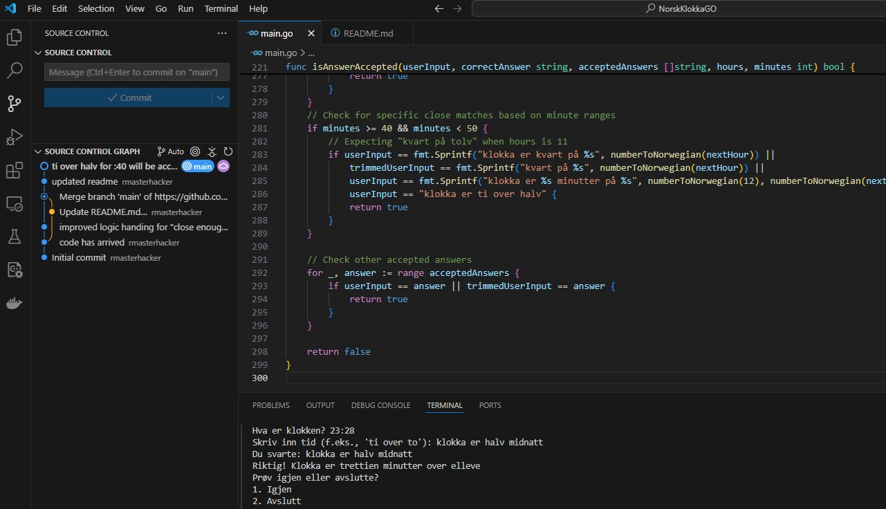

# Den Norske Klokken. 

Learn on the command line. Better yet...make something like this yourself if you are trying to learn!

## Features

- Generates random times using a 24-hour clock format.
- Accepts various formats of time responses in Norwegian.
- Provides feedback for correct and incorrect answers.
- Handles close matches for user input to enhance gameplay.
- Graceful exit when interrupted.

## Functions

### `main()`

The entry point of the application. This function:

- Seeds the random number generator.
- Sets up a reader to capture user input.
- Initializes signal handling for a graceful exit.
- Generates random hours and minutes for the game.
- Displays the time and prompts the user for their answer.
- Provides feedback based on user input and allows retrying or exiting.

### `formatNorwegianTime(hours, minutes int) string`

Converts hours and minutes into a Norwegian-style time format. This function:

- Translates 24-hour format into a format suitable for Norwegian time-telling (1-12 hours).
- Handles specific cases such as "halv" (half past), "kvart over" (quarter past), and "kvart på" (quarter to).
- Returns a string representing the time in Norwegian.

### `handleMinutesLessThanHalfPast(hours, minutes int) string`

Handles formatting for times where minutes are less than half past the hour (0-29 minutes). This function:

- Returns various formatted strings based on the number of minutes past the hour.

### `handleMinutesMoreThanHalfPast(nextHour, minutes int) string`

Handles formatting for times where minutes are more than half past the hour (30-59 minutes). This function:

- Returns various formatted strings based on the number of minutes to the next hour.

### `numberToNorwegian(n int) string`

Converts an integer to its corresponding Norwegian text representation. This function:

- Returns the Norwegian word for numbers from 0 to 59.
- Ensures the number is within valid bounds.

### `generateAcceptedAnswers(hours, minutes int) []string`

Generates a list of accepted answers for the given hour and minute. This function:

- Returns the correct answer along with other acceptable variations based on the minutes.
- Handles special cases for 0, 15, 30, and 45 minutes.

### `isAnswerAccepted(userInput, correctAnswer string, acceptedAnswers []string, hours, minutes int) bool`

Checks if the user input matches any accepted answers. This function:

- Normalizes user input for case insensitivity.
- Compares user input against the correct answer and accepted alternatives.
- Allows for close matches based on specific minute ranges (e.g., within 5 minutes of the hour).
- Returns `true` if there is a match and `false` otherwise.

## Screenshot of the build

